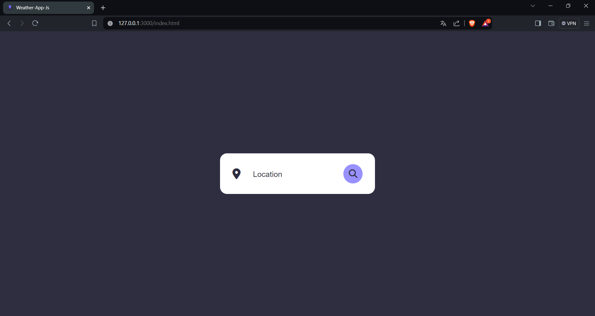
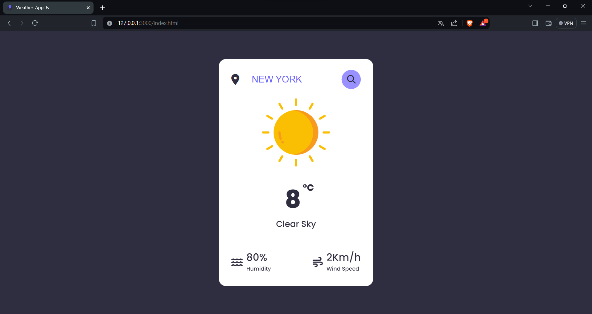
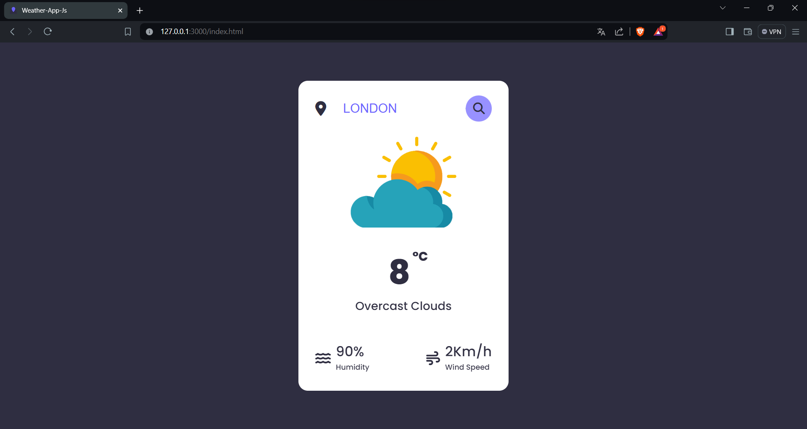
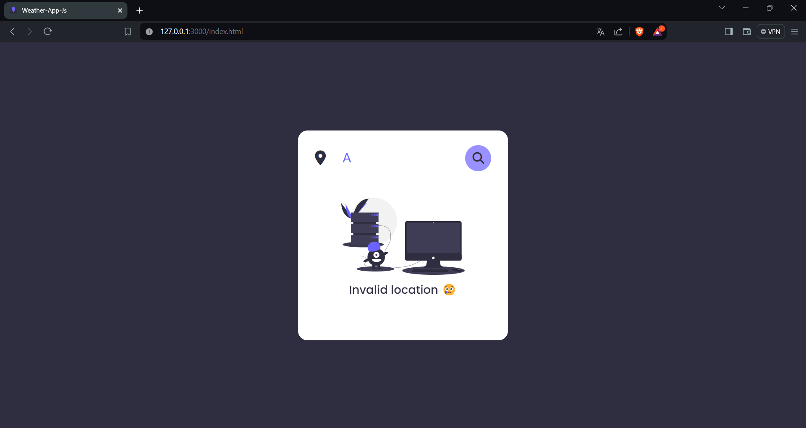

# Weather App

🌤️ Welcome to Weather App! A simple and efficient application for checking the weather forecast of any location.

## Overview

Weather App allows you to quickly retrieve weather information for any city around the world. With a clean and intuitive user interface, staying updated with the weather has never been easier.

## Features

- **Real-Time Weather**: Get real-time weather updates for any location.
- **City Search**: Search for weather information by entering the name of the city.
- **Detailed Weather Data**: View detailed weather data including temperature, humidity, and wind speed.
- **Visual Representation**: Dynamic icons representing different weather conditions for easy understanding.
- **Responsive Design**: Access the app seamlessly across different devices.

## Requirements

- Modern web browser with JavaScript enabled.

## Installation

1. Clone this repository to your local machine.
2. Open the `index.html` file in your preferred web browser.

## Usage

1. Upon opening the application, you'll see a search box to enter the location.
2. Enter the name of the city you want to check the weather for and click the search button.
3. Weather information for the specified city will be displayed including temperature, description, humidity, and wind speed.

## Example Usage

1. Checking weather for a city:
   ```
   Weather App
   Enter Location: New York
   ```

2. Viewing weather information:
   ```
   Weather App
   Location: New York
   Temperature: 21°C
   Description: Partly Cloudy
   Humidity: 65%
   Wind Speed: 12 Km/h
   ```

## Screenshots


*Description: Weather App initial menu*


*Description: Weather App displaying weather information for New York.*


*Description: Weather App showcasing detailed weather data for London.*


*Description: Weather App displaying error 404*

## Contribution

If you encounter any issues or have suggestions to improve the Weather App, feel free to open an issue or submit a pull request. Your contribution is highly appreciated!

## License

This project is licensed under the [MIT License](https://opensource.org/licenses/MIT).